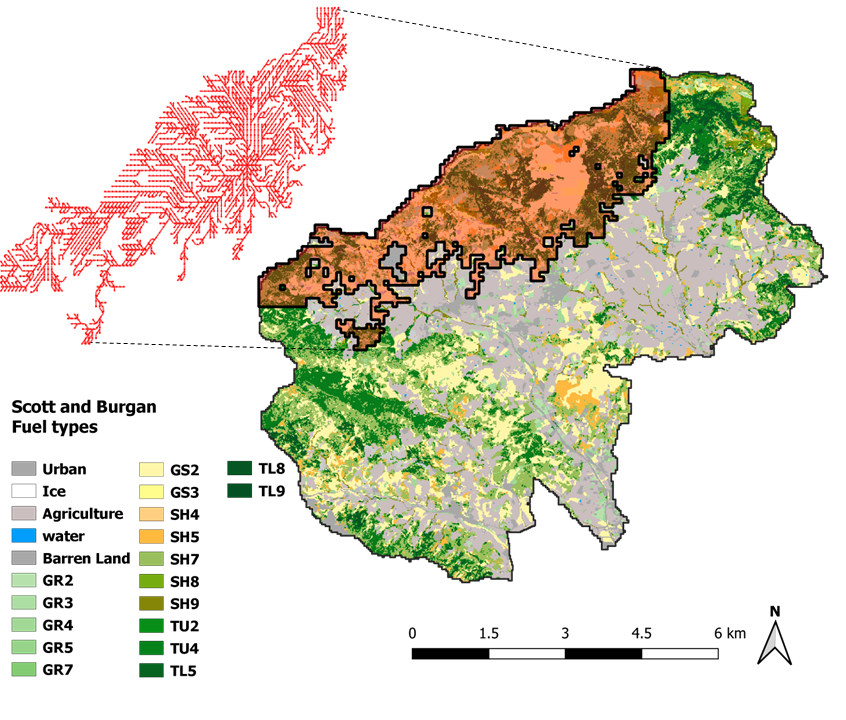

# C2F+S&B
## Jaime Carrasco, Cristobal Pais, José Ramón Gonzalez, Jordi Garcia, David Palacios, Rodrigo Mahaluf, and Andres Weintraub
C2F+S&B is an open-source wildfire simulator based on Cell2Fire and the Scott And Burgan Fuel Models

# Requirements
- Boost (C++)
- Eigen (C++)
- Python 3.6
- numpy
- pandas
- matplotlib
- seaborn
- tqdm
- rasterio
- networkx (for stats module)

# Disclaimer
This software is for research use only. There is no warranty of any kind; there is not even the implied warranty of fitness for use.

# Introduction
C2F+S&B is a vertion of the fire spread simulator [Cell2Fire](https://github.com/cell2fire/Cell2Fire) for Scott and Burgan fuel system. As Cell2Fire, i) the landscape is characterized as a grid, where every cell has the same size, and the necesary information to simulate fire spread, i.e. fuel type, elevation, and ignition probability; ii) exploits parallel computation methods which allows users to run large-scale simulations in short periods of time; iii) the fires spread within each cell is assumed to be elliptical; and iv) it includes powerful statistical, graphical output, and spatial analysis features to facilitate the display and analysis of projected fire growth.

Unlike Cell2Fire, the fire spread is governed by spread rates predicted by the Scott and Burgan fuel system, and uses it's weathers scenarios to take into account the moisture of fine and dead particles. 

Work in progress documentation is available at [readthedocs](https://cell2fire.readthedocs.io/en/latest/) and there is an original draft of a paper on [frontiers](https://www.frontiersin.org/).

# Requirements
* g++
* Boost (C++) 
* Eigen (C++)
* Python 3.6 or higher
* numpy
* pandas
* matplotlib
* seaborn
* tqdm 
* opencv
* imread
* networkx (for stats module)

# Installation
Installation may require some familiarity with C++, make, and Python.
* cd Cell2FireSB/Cell2FireC
* (edit Makefile to have the correct path to Eigen)
* make
* cd .. 
* pip install -r requirements.txt


# Usage
In order to run the simulator and process the results, the following command can be used:
```
$ python main.py --input-instance-folder /data/Hom_Fuel_101_40x40/ --output-folder results/Hom_Fuel --ignitions --sim-years 1 --nsims 100 --grids --finalGrid --weather rows --nweathers 1 --Fire-Period-Length 1.0 --output-messages --ROS-CV 0.8 --seed 123 --stats --allPlots --IgnitionRad 1
```
For the full list of arguments and their explanation use:
```
$ python main.py -h
```

# Console usage (on development)
To use the simulator with a console (via python), the following command can be used:
```
$ python window.py
```
Important: not all arguments are implemented on the console

# Output examples
## Provincat's Zone 60 (Catalonian Instance): forest and a simulated fire spread with it's corresponding scar and growth propagation tree. 

## Risck metrics: Burn Probability (BP), Betweenness Centrality (BC), Downstream Protection Value (DPV), and Growth Propagation Tree (GPT). 

